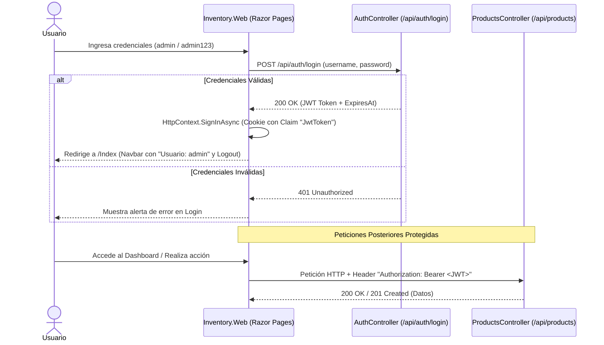
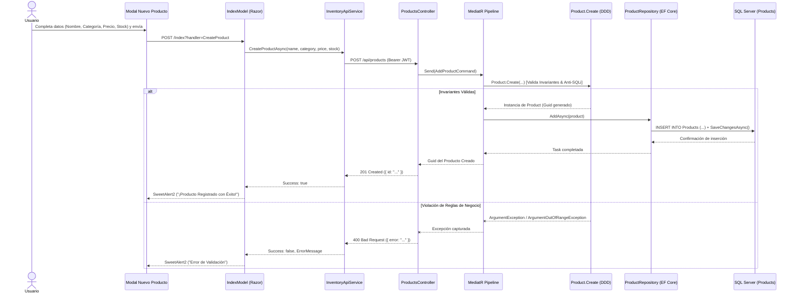
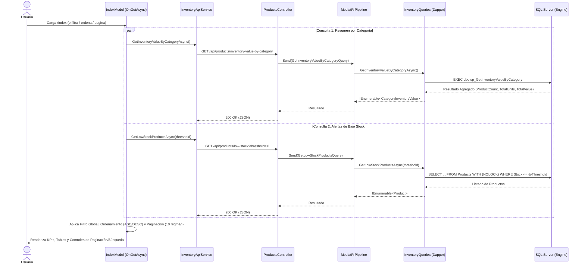

# 📦 Mini Sistema de Gestión de Inventario (API REST & Razor Pages) - Prueba Técnica

Este proyecto es una solución empresarial desarrollada en **.NET 8 (C#)** para la gestión y análisis integral de inventario. Implementa principios de **Clean Architecture**, el patrón **CQRS** (Command Query Responsibility Segregation) con **MediatR**, una estrategia de **persistencia híbrida** (Entity Framework Core para escrituras y Dapper para lecturas de alto rendimiento), Procedimientos Almacenados en **SQL Server**, autenticación **JWT** con sesiones en cookies y un frontend responsivo en **ASP.NET Core Razor Pages** con **Bootstrap 5.3**.

---

## 🏗️ Decisiones de Arquitectura

* **Clean Architecture & Desacoplamiento:** La solución está organizada en 4 capas estrictamente desacopladas (*Domain*, *Application*, *Infrastructure*, *Presentation*), donde las dependencias apuntan exclusivamente hacia el núcleo de negocio sin acoplamientos externos.
* **Patrón CQRS (Command Query Responsibility Segregation):** Mediante **MediatR**, se aísla completamente la lógica de mutación (*Commands*) de la lógica de consulta analítica (*Queries*), permitiendo optimizar cada canal de manera independiente.
* **Persistencia Híbrida (Dual ORM Strategy):**
  * **Escrituras (Commands):** Se utiliza **Entity Framework Core 8** (`ApplicationDbContext`), aplicando **Domain-Driven Design (DDD)** con métodos de fábrica (`Product.Create`), validación estricta de invariantes de dominio y transaccionalidad atómica (`SaveChangesAsync`).
  * **Lecturas (Queries):** Se utiliza el micro-ORM **Dapper** (`InventoryQueries`), maximizando la velocidad de respuesta sin sobrecarga de tracking de memoria (*No Tracking*), ejecutando consultas SQL directas con hint `WITH (NOLOCK)` y consumiendo Procedimientos Almacenados.
* **Procedimiento Almacenado T-SQL:** La lógica agregada de consolidación de inventario (`sp_GetInventoryValueByCategory`) se ejecuta de forma nativa en el motor de SQL Server, calculando variedad de productos, unidades totales y valor monetario total por categoría.
* **Seguridad & Autenticación Híbrida:**
  * **API REST:** Protegida con tokens **JWT** firmados con HMAC SHA-256 (`[Authorize]`), con claims de identidad y rol.
  * **Frontend (Razor Pages):** Autenticación basada en cookies cifradas (`CookieAuthenticationDefaults`) que almacena el token JWT de la sesión y lo reenvía de forma transparente a la API mediante un cliente HTTP tipado (`IInventoryApiService`).
* **Protección contra Inyección SQL:** Validación de texto seguro mediante expresiones regulares compiladas en la entidad de dominio `Product` y parámetros tipados en todas las consultas de Dapper y EF Core.
* **Observabilidad & Logging Estructurado:** Integración de **Serilog** con formateo enriquecido en consola y middleware de captura de peticiones HTTP en tiempo real (`UseSerilogRequestLogging`).

---

## 🛠️ Stack Tecnológico y Requisitos

### Tecnologías Utilizadas

| Tecnología | Versión Mínima / Sugerida | Propósito en la Arquitectura |
| :--- | :--- | :--- |
| **C# / .NET** | `^8.0` (LTS) | Lenguaje y framework base utilizando características modernas (Records, Pattern Matching, File-scoped namespaces). |
| **ASP.NET Core Web API** | `^8.0` | API RESTful con controladores livianos, middleware de autenticación JWT y documentación interactiva con **Swagger**. |
| **ASP.NET Core Razor Pages** | `^8.0` | Frontend server-side rendering con componentes modulares, modelos de página y protección `[Authorize]`. |
| **MediatR** | `^12.4.1` | Implementación del patrón Mediator y orquestador central de CQRS (Commands y Queries desacoplados). |
| **Entity Framework Core** | `^8.0.8` | ORM para el canal de escritura, mapeo de entidades de dominio y persistencia transaccional en SQL Server. |
| **Dapper** | `^2.1.35` | Micro-ORM de alto rendimiento para el canal de lectura y ejecución directa del Procedimiento Almacenado T-SQL. |
| **SQL Server** | `2022` (o 2019) | Motor de base de datos relacional con índices optimizados y stored procedures. |
| **Docker & Docker Compose** | `^24.0` / Compose v2 | Contenerización oficial de SQL Server 2022 con scripts de inicialización idempotentes. |
| **Serilog** | `^8.0.2` | Framework de logging estructurado con enriquecimiento de contexto y registro de peticiones HTTP. |
| **xUnit & Moq** | `^2.8` / `^4.20` | Suite de pruebas unitarias automatizadas para validación de comandos, reglas de negocio y casos de excepción. |
| **Bootstrap** | `^5.3.3` | Framework CSS responsivo para diseño adaptativo, tablas interactivas y modales. |
| **SweetAlert2** | `^11.0` (CDN) | Librería de alertas visuales enriquecidas para confirmaciones, advertencias y retroalimentación de operaciones. |

### Requisitos Mínimos del Sistema

* **Para Despliegue con Docker (Recomendado):**
  * Docker Desktop (o Docker Engine en Linux) con Docker Compose v2 activo.
  * .NET 8.0 SDK instalado localmente.
  * Cliente Git para clonación del repositorio.
* **Para Despliegue Nativo:**
  * [.NET 8.0 SDK](https://dotnet.microsoft.com/download/dotnet/8.0) instalado.
  * Instancia local de SQL Server 2019/2022 o LocalDB activa en el puerto `1433`.
  * Herramienta cliente de SQL (SSMS, Azure Data Studio o sqlcmd).

---

## 📂 Estructura del Proyecto

La solución está organizada siguiendo estrictamente los principios de **Clean Architecture**, manteniendo la lógica de negocio completamente aislada de la infraestructura y de los mecanismos de entrega HTTP:

```text
InventorySystemGD/
├── Inventory.Domain/                    # Capa 1: Núcleo de Dominio (Sin dependencias externas)
│   ├── Entities/
│   │   └── Product.cs                   # Agregado raíz con Factory Method e invariantes DDD
│   ├── Interfaces/
│   │   ├── IProductRepository.cs        # Contrato de persistencia para escrituras (Commands)
│   │   └── IInventoryQueries.cs         # Contrato de acceso a datos para lecturas (Queries / Dapper)
│   └── Models/
│       └── CategoryInventoryValue.cs    # DTO inmutable de lectura mapeado al Stored Procedure
│
├── Inventory.Application/               # Capa 2: Casos de Uso y Orquestación CQRS (MediatR)
│   └── Products/
│       ├── Commands/
│       │   └── AddProduct/              # Comando de creación de productos
│       │       ├── AddProductCommand.cs
│       │       └── AddProductCommandHandler.cs
│       └── Queries/
│           ├── GetLowStockProducts/     # Consulta de existencias críticas (Dapper)
│           │   ├── GetLowStockProductsQuery.cs
│           │   └── GetLowStockProductsQueryHandler.cs
│           └── GetInventoryValueByCategory/ # Consulta analítica valorizada (Stored Procedure)
│               ├── GetInventoryValueByCategoryQuery.cs
│               └── GetInventoryValueByCategoryQueryHandler.cs
│
├── Inventory.Infrastructure/            # Capa 3: Persistencia y Acceso a Datos
│   ├── Persistence/
│   │   ├── ApplicationDbContext.cs      # DbContext de EF Core para operaciones de escritura
│   │   └── ProductRepository.cs         # Repositorio EF Core con ChangeTracker y SaveChanges
│   └── Queries/
│       └── InventoryQueries.cs          # Consultas Dapper con SQL nativo y llamada al SP
│
├── Inventory.Api/                       # Capa 4: Presentación Backend (ASP.NET Core Web API)
│   ├── Controllers/
│   │   ├── AuthController.cs            # Emisión de tokens JWT con claims y HMAC SHA-256
│   │   └── ProductsController.cs        # Endpoints protegidos [Authorize] con MediatR
│   ├── appsettings.json                 # Cadenas de conexión, configuración JWT y Serilog
│   └── Program.cs                       # Inyección de dependencias, middlewares y Swagger
│
├── Inventory.Web/                       # Capa 4: Presentación Frontend (Razor Pages)
│   ├── Pages/
│   │   ├── Index.cshtml                 # Panel principal con KPIs, tablas, buscadores y modal
│   │   ├── Index.cshtml.cs              # Lógica de vista, paginación, ordenamiento y filtros
│   │   ├── Login.cshtml                 # Formulario de autenticación
│   │   ├── Login.cshtml.cs              # Generación de sesión con cookie y claims de identidad
│   │   ├── Logout.cshtml                # Cierre de sesión y revocación de cookie
│   │   ├── Logout.cshtml.cs             # Manejador de SignOutAsync
│   │   └── Shared/
│   │       └── _Layout.cshtml           # Plantilla maestra con selector Dark/Light y User Badge
│   ├── Services/
│   │   └── InventoryApiService.cs       # Cliente HTTP Tipado con reenvío automático de JWT
│   ├── wwwroot/
│   │   ├── css/site.css                 # Estilos personalizados, animaciones y temas
│   │   └── js/site.js                   # Scripts de interfaz y control de temas
│   └── Program.cs                       # Configuración de Cookie Authentication y DI
│
├── Inventory.UnitTests/                 # Suite de Pruebas Unitarias Automatizadas
│   └── Commands/
│       └── AddProductCommandHandlerTests.cs # 11 pruebas con xUnit y Moq
│
├── scripts/                             # Scripts T-SQL Idempotentes
│   └── 01_CreateProductsAndStoredProcedure.sql # Creación de tabla, índices y Stored Procedure
│
├── .github/workflows/                   # Pipelines de CI/CD (GitHub Actions)
│   ├── ci.yml                           # Integración Continua: Restore, Build y Tests
│   └── cd.yml                           # Entrega Continua: Publicación de binarios
│
└── docker-compose.yml                   # Orquestación del contenedor SQL Server 2022
```

---

## 🔄 Flujos de Procesamiento y Actividades (Sequence Diagrams)

### 1. 🔐 Autenticación y Gestión de Sesión (Login / Token Forwarding)



---

### 2. 📝 Creación de Producto (Command Side / Write Path - EF Core)



---

### 3. 📊 Consulta Analítica y Reportes (Query Side / Read Path - Dapper & SP)



---

## 🚀 Instalación y Despliegue

### Opción A: Docker / Docker Compose (Recomendado)

Ideal para levantar la base de datos SQL Server 2022 de forma aislada y reproducible:

1. **Clonar el repositorio y entrar al directorio:**
   ```bash
   git clone https://github.com/marianogd98/InventorySystemGD.git
   cd InventorySystemGD
   ```

2. **Iniciar el contenedor de SQL Server:**
   ```bash
   docker compose up -d
   ```
   > El contenedor inicializará la base de datos `InventoryDb`, las tablas, índices optimizados y el Procedimiento Almacenado mediante el script automatizado.

3. **Ejecutar la Web API (`Inventory.Api`):**
   ```bash
   dotnet run --project Inventory.Api
   ```
   * **Swagger UI:** [http://localhost:5102/swagger](http://localhost:5102/swagger)

4. **Ejecutar el Cliente Web (`Inventory.Web`):**
   En una segunda terminal:
   ```bash
   dotnet run --project Inventory.Web
   ```
   * **Aplicación Web:** [http://localhost:5032](http://localhost:5032)

---

### Opción B: Entorno Nativo (.NET SDK + SQL Server Local)

1. **Clonar e instalar dependencias:**
   ```bash
   git clone https://github.com/marianogd98/InventorySystemGD.git
   cd InventorySystemGD
   dotnet restore
   ```

2. **Inicializar la Base de Datos:**
   Ejecuta el script SQL en tu instancia local de SQL Server:
   * Ubicación: [`scripts/01_CreateProductsAndStoredProcedure.sql`](scripts/01_CreateProductsAndStoredProcedure.sql)

3. **Ajustar la cadena de conexión:**
   Verifica que `ConnectionStrings:DefaultConnection` en `Inventory.Api/appsettings.json` apunte a tu servidor local.

4. **Compilar y Ejecutar:**
   ```bash
   dotnet build
   dotnet run --project Inventory.Api
   # En otra terminal:
   dotnet run --project Inventory.Web
   ```

---

## 🔒 Credenciales de Acceso y Datos Semilla

| Componente | Usuario / Identificador | Contraseña / Detalle |
| :--- | :--- | :--- |
| **Inicio de Sesión (Web & API)** | `admin` | `admin123` |
| **Base de Datos SQL Server (Docker)** | `sa` | `SuperSecret123!` (Puerto: `1433`) |
| **Base de Datos por Defecto** | `InventoryDb` | Incluye 25 productos semilla en 6 categorías |

---

## 🧪 Consumo del API REST (Endpoints)

### 1. Autenticación (POST)
Obtiene el token JWT Bearer necesario para consumir los endpoints protegidos:
```bash
curl -X POST http://localhost:5102/api/auth/login \
     -H "Content-Type: application/json" \
     -d '{
       "username": "admin",
       "password": "admin123"
     }'
```
**Respuesta exitosa (`200 OK`):**
```json
{
  "token": "eyJhbGciOiJIUzI1NiIsInR5cCI6IkpXVCJ9...",
  "tokenType": "Bearer",
  "expiresAt": "2026-08-31T05:30:00Z"
}
```

---

### 2. Registrar un Nuevo Producto (POST)
Endpoint protegido con `[Authorize]`. Persiste mediante EF Core y valida invariantes de dominio:
```bash
curl -X POST http://localhost:5102/api/products \
     -H "Content-Type: application/json" \
     -H "Authorization: Bearer <TU_TOKEN_JWT>" \
     -d '{
       "name": "Monitor Gamer 27 Pulgadas 165Hz",
       "category": "Periféricos",
       "price": 289.99,
       "stock": 15
     }'
```
**Respuesta exitosa (`201 Created`):**
```json
{
  "id": "e4f8b91a-7c3d-4e2f-8a1b-9c0d1e2f3a4b"
}
```

---

### 3. Consultar Productos con Bajo Stock (GET)
Endpoint protegido con `[Authorize]`. Ejecuta consulta Dapper de alta velocidad:
```bash
curl -X GET "http://localhost:5102/api/products/low-stock?threshold=10" \
     -H "Authorization: Bearer <TU_TOKEN_JWT>"
```
**Respuesta exitosa (`200 OK`):**
```json
[
  {
    "id": "a1b2c3d4-e5f6-7a8b-9c0d-1e2f3a4b5c6d",
    "name": "Teclado Mecánico RGB",
    "category": "Periféricos",
    "price": 85.50,
    "stock": 3,
    "createdAt": "2026-08-30T10:00:00Z"
  }
]
```

---

### 4. Consultar Resumen Valorizado por Categoría (GET)
Endpoint protegido con `[Authorize]`. Ejecuta el Procedimiento Almacenado T-SQL mediante Dapper:
```bash
curl -X GET http://localhost:5102/api/products/inventory-value-by-category \
     -H "Authorization: Bearer <TU_TOKEN_JWT>"
```
**Respuesta exitosa (`200 OK`):**
```json
[
  {
    "category": "Almacenamiento",
    "productCount": 4,
    "totalUnits": 95,
    "totalInventoryValue": 8945.50
  },
  {
    "category": "Procesadores",
    "productCount": 5,
    "totalUnits": 42,
    "totalInventoryValue": 14280.00
  }
]
```

---

## 🖥️ Interfaz Web (Front-end)

El proyecto incluye un cliente web en **ASP.NET Core Razor Pages** con diseño profesional y adaptativo:

* **Acceso:** [http://localhost:5032](http://localhost:5032)
* **Funcionalidades Principales:**
  1. **Autenticación Completa (Login / Logout):** Formulario de acceso protegido, badge en el navbar con el nombre del usuario autenticado (`👤 Usuario: admin`) y botón de cierre de sesión junto al selector de tema.
  2. **Tarjetas KPI Globales:** Métricas consolidadas en tiempo real: *Valor Total del Inventario*, *Unidades Totales en Stock* y *Variedad de Productos*.
  3. **Tabla 1 - Resumen por Categoría:**
     * **Margen Izquierdo:** Buscador global (filtra por nombre de categoría, existencias o variedad) con botón de limpieza `(X)`.
     * **Margen Derecho:** Indicador de rango (`Mostrando 1 - 10 de X categorías`) y botones de paginación (`< 1 2 3 >`).
     * **Columnas:** Ordenamiento interactivo **ASC / DESC** en todas las columnas con iconos dinámicos.
  4. **Tabla 2 - Alertas de Bajo Stock:**
     * **Cabecera:** Modificador dinámico del umbral de existencias críticas (sanitizado contra valores negativos y caracteres no numéricos) + botones de acceso rápido (**5**, **10**, **20**).
     * **Margen Izquierdo:** Buscador global (filtra por producto, categoría, precio o stock).
     * **Margen Derecho:** Indicador de rango (`Mostrando 1 - 10 de Y productos`) y botones de paginación (`< 1 2 3 >`).
     * **Columnas:** Ordenamiento interactivo **ASC / DESC** en todas las columnas.
  5. **Modal de Registro (`#createProductModal`):** Formulario validado para registrar nuevos productos con alertas visuales de **SweetAlert2**.
  6. **Selector de Tema:** Alternador de **Modo Claro / Modo Oscuro** con persistencia en `localStorage`.

---

## 🧪 Pruebas Unitarias Automatizadas

El proyecto cuenta con una suite completa de pruebas unitarias en `Inventory.UnitTests` utilizando **xUnit**, **Moq** y **FluentAssertions**:

```bash
dotnet test --configuration Release
```

**Resultado de ejecución:**
```text
Passed!  - Failed: 0, Passed: 11, Skipped: 0, Total: 11, Duration: 35 ms - Inventory.UnitTests.dll (net8.0)
```

**Casos de prueba cubiertos:**
* `Handle_ValidCommand_ShouldCreateProductAndReturnGuid`: Creación exitosa y retorno de Guid único.
* `Handle_EmptyName_ShouldThrowArgumentException`: Validación de campo requerido de nombre.
* `Handle_SqlInjectionInName_ShouldThrowArgumentException`: Protección de seguridad anti-SQLi.
* `Handle_EmptyCategory_ShouldThrowArgumentException`: Validación de campo requerido de categoría.
* `Handle_NegativePrice_ShouldThrowArgumentOutOfRangeException`: Invariante de precio no negativo.
* `Handle_NegativeStock_ShouldThrowArgumentOutOfRangeException`: Invariante de stock inicial no negativo.
* `Handle_RepositoryFailure_ShouldPropagateException`: Tolerancia a fallos de persistencia.

---

## 🔄 Integración y Despliegue Continuo (CI/CD con GitHub Actions)

El repositorio implementa flujos de trabajo automatizados en `.github/workflows/`:

* **Pipeline de Integración Continua ([`ci.yml`](.github/workflows/ci.yml)):**
  * Se ejecuta en cada `push` o `pull_request` sobre `prod`, `dev`, `mariano-dev`, `feature/**`.
  * Restaura paquetes NuGet con caché, compila en Release y ejecuta el 100% de las pruebas unitarias.
* **Pipeline de Despliegue Continuo ([`cd.yml`](.github/workflows/cd.yml)):**
  * Se dispara al realizar merge en la rama productiva (`prod`) o crear tags de versión (`v*`).
  * Publica y empaqueta los binarios optimizados de `Inventory.Api` e `Inventory.Web` como artefactos descargables.
